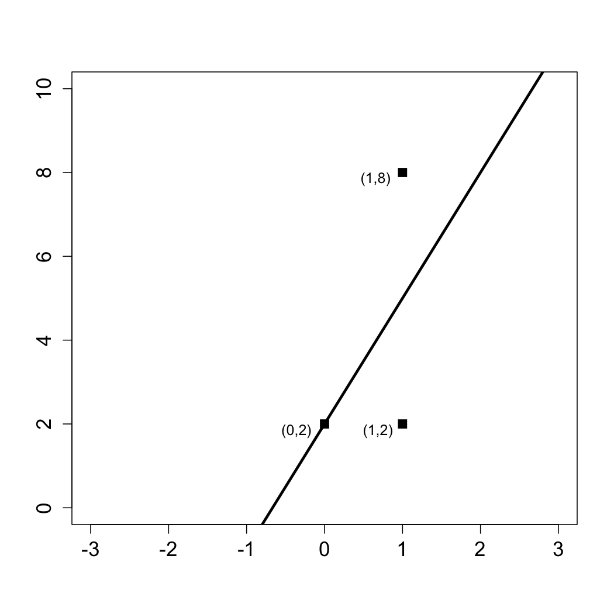
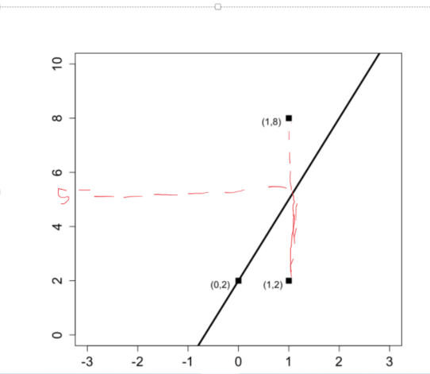

The following figure shows three data points and the best fit line:
y = 3x + 2.

The x-coordinate, or "x", is our independent variable and the y-coordinate, or "y", is our dependent variable.

What is the baseline prediction?



**Baseline model** - Is when all of the independent variables are equal to zero. We are only concerned about the dependent variables. We have 3 dependent variables.


```{r}
(2+2+8)/3
```


What is the Sum of Squared Errors (SSE) ?




Actual y value - predicted y value


```{r}
(2-2)^2 + (2-5)^2 + (8-5)^2 


```

What is the Total Sum of Squares (SST) ?

actual y values - predicted_baseline_y value

baseline value was 4


```{r}
(2-4)^2 + (2-4)^2 +(8-4)^2

```

What is the R² of the model?
1- (SSE/SST)

```{R}
1 - (18/24)
```

In R, use the dataset wine.csv to create a linear regression model to predict Price using HarvestRain and WinterRain as independent variables. Using the summary output of this model, answer the following questions:

What is the "Multiple R-squared" value of your model?


```{R}
model <- lm(Price ~ HarvestRain + WinterRain, data=wine)
summary(model)
```

Using the data set wine.csv, what is the correlation between HarvestRain and WinterRain?


```{R}
cor(wine$HarvestRain,wine$WinterRain)

```


```{R}
1 - (18/24)
```


```{R}
1 - (18/24)
```